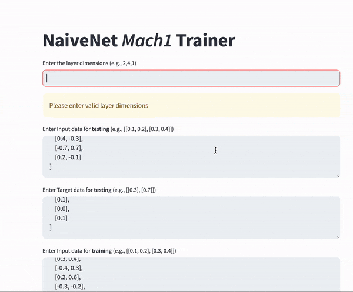

# Naive Net Mach1
Naive Net Mach1 is a from-scratch, no-library implementation of a traditional neural network with a simple, lightweight architecture.

## Implementation.ipynb

This notebook consists of an example of how to use the Mach1 Neural network as a module for whatever you need. The Mach1 module offers a very simple approach to implement and utilise neural networks. 
#### Using just 3 lines of simple python code you can initialise and train a deep neural network.

### Using Mach1 Module
#importing the module

import Mach1_NaiveNet as mach1 

#initialising the network with layer sizes including input/output and hidden layers

network = mach1.getNetwork(layerDims=[2, 8, 8, 8, 4, 1]) 

#pass the network, data and hyperparameters as arguments to the trainer.

mach1.trainer(network, xTrain, yTrain, lr = 0.001, epochs=1000) 

#You can call inference by using network(), where you can pass a List of floats as argument
#Additional feature like evaluating across a data set are provided in the module

## app.py
app.py is a Streamlit application with the Mach1 neural network embedded. It offers a simple graphical interface for you to provide dataset hyperparameters, observe the training process, and refine your approach.

